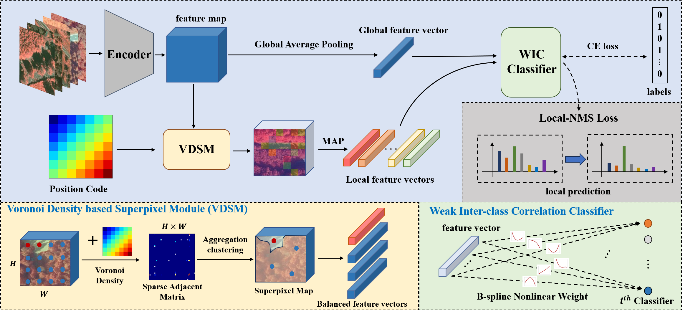
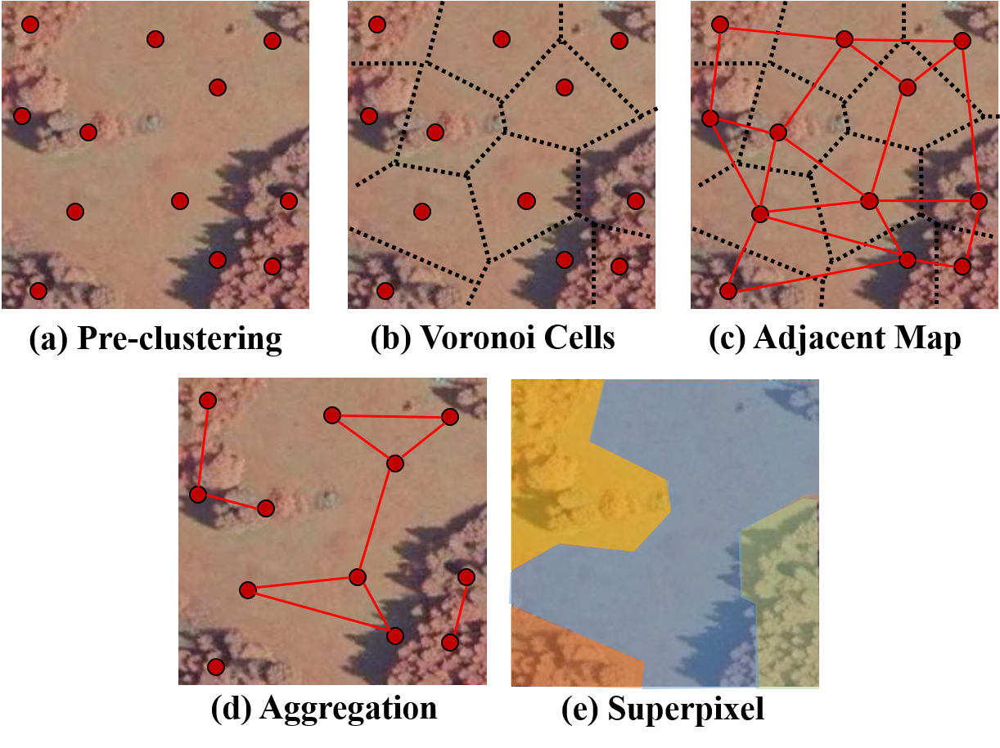

# VoLUNet

The code is for the paper "A Voronoi Density based Locally Unique Classification Network for Fine-grained Mulitilabel Learning"

<p align="left">
  
</p>

The voronoi density based superpixel generation module designed in this paper is shown in next figure.

<p align="left">
  
</p>

## Overview

+ `helper_functions/` includes helper functions and dataloader files
+ `loss_functions/` includes loss computation files
+ `models/` includes related model and module

## Usage

### Dataset

Please prepare related datasets: 

- TreeSatAI: [https://zenodo.org/records/6780578](https://zenodo.org/records/6780578)
- GeoLifeCLEF: [https://cocodataset.org/#download](https://www.kaggle.com/competitions/geolifeclef-2024)
- FathomNet: [https://cocodataset.org/#download](https://www.kaggle.com/competitions/fathomnet-out-of-sample-detection)

### Train and Test

+ Use the following command for training with TResNet-L

  ```
  python train.py \
  --img_dir=path_of_images \
  --csv_path=path_of_csv_file \
  --backbone-name=tresnet_l \
  --image-size=224 \
  --model-path=path_of_pretrained_weights \
  --output-path=path_to_save_checkpoints \
  --subsampling \
  --sub-h=4 \
  --sub-w=4 \
  --min-superpixels=6
  ```

+ Use the following command for testing with TResNet-L

  ```
  python val.py \
  --img_dir=path_of_images \
  --csv_path=path_of_csv_file \
  --backbone-name=tresnet_l \
  --ckpt-path=path_of_model_weights
  ```

## Citation

If you have any question, please discuss with me by sending email to liubinghao@buaa.edu.cn

## References

The code is based on [ASL](https://github.com/Alibaba-MIIL/ASL) and [efficient-kan](https://github.com/Blealtan/efficient-kan). Thanks for their great works!
